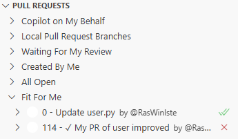
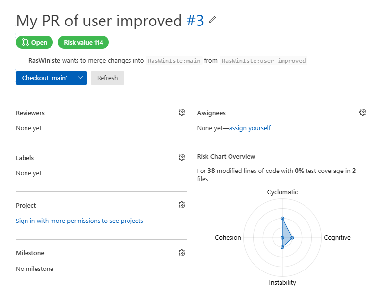

> Get a direct overview of Pull Request complexity.

This extension adds functionality to Microsoft's [GitHub Pull Requests](https://marketplace.visualstudio.com/items?itemName=GitHub.vscode-pull-request-github&ssr=false) plugin for Visual Studio Code. For more details on the original features and plugin, please visit its [Marketplace page](https://marketplace.visualstudio.com/items?itemName=GitHub.vscode-pull-request-github&ssr=false).

# About the Extension

This extension is developed and maintained by the **SNAIL Research Laboratory** at the **University of Namur** (Belgium).
For more information or to get in touch, visit the [SNAIL website](https://snail.info.unamur.be/).

# Purpose

The main goal of the extension is to provide reviewers with a **quick overview of Pull Request complexity**.

Recent research has shown that **cognitive biases** can influence how developers review Pull Requests, which may negatively impact review quality. By offering a visual summary of a Pull Request’s complexity, this extension aims to:

- Raise awareness about complexity before review
- Help reviewers make more informed decisions
- Improve the overall quality of code reviews

# Key Features

To achieve this goal, the extension introduces two main features:

1. `Fit For Me` Pull Request Category

   Pull Requests are automatically sorted into a new category called **"Fit For Me"**, based on their **total risk score**. This score is determined using an aggregate formula based on a set of metrics describing the complexity of the Pull Request.

   

2. Radar Chart Visualization

   Each Pull Request overview includes a **radar chart** displaying the calculated complexity metrics.

   - The radar chart consists of **five rings**, ranging from **the center (indicating lower risk)** to **the outermost ring (indicating higher risk)**.
   - Each axis of the chart represents a different metric.
   - The chart gives reviewers an immediate, visual understanding of the Pull Request’s complexity profile.

   

# Getting Started

This extension relies on a **backend API** that analyzes Pull Requests and computes complexity metrics.
To set up the server, please visit the [analysis server repository](https://github.com/snail-unamur/analyse-pull-request-server).

## Steps to Set Up

1. **Install and configure the original GitHub Pull Requests plugin**
   Follow the setup instructions provided by Microsoft on the [plugin's Marketplace page](https://marketplace.visualstudio.com/items?itemName=GitHub.vscode-pull-request-github&ssr=false).

2. **Configure the analysis server URL**
   In the extension settings, locate the field called **`Improved Pull Requests: Server URL`** and enter the URL of your analysis server.

You're now ready to go! 🎉

# Configuring the Extension

The configuration of complexity metrics is handled by the **analysis server**.
For more details on how to configure the metrics or customize the analysis, please refer to the [analysis server repository](https://github.com/snail-unamur/analyse-pull-request-server).

For information on configuring the original GitHub Pull Requests plugin, visit the [plugin's main page](https://marketplace.visualstudio.com/items?itemName=GitHub.vscode-pull-request-github&ssr=false).

All settings added by this extension are labeled with **"Improved Pull Requests"** in the Visual Studio Code settings panel.

# Architecture of the Extension

The functionality added by this extension is implemented in the `src/improvedPullRequest/` folder.
This folder contains the following core components:

- **`improvedPullRequest`**
  A proxy of the original Pull Request model. It adds metrics information without modifying the original logic.

- **`improvedPullRequestClient`**
  A client module responsible for communicating with the analysis server and retrieving complexity metrics for Pull Requests.

- **`improvedPullRequestMetrics`**
  An interface defining the structure of the metrics information added to the original Pull Request model.

- **`sorteablePullRequests`**
  A helper object that retrieves metrics for multiple Pull Requests and sorts them based on their **worst risk value**.

Since the analysis server requires a GitHub access token to retrieve Pull Request data, the `improvedPullRequestClient` uses the **same access token** stored by the original GitHub Pull Requests plugin.
For security, the client is created and managed using the **credentials class**, following the same mechanism as the original plugin.

The radar chart visualization is implemented in the `webviews/components/radarChart.tsx` file. It is integrated into the Pull Request sidebar UI via the `webviews/components/sidebar.tsx` file.
